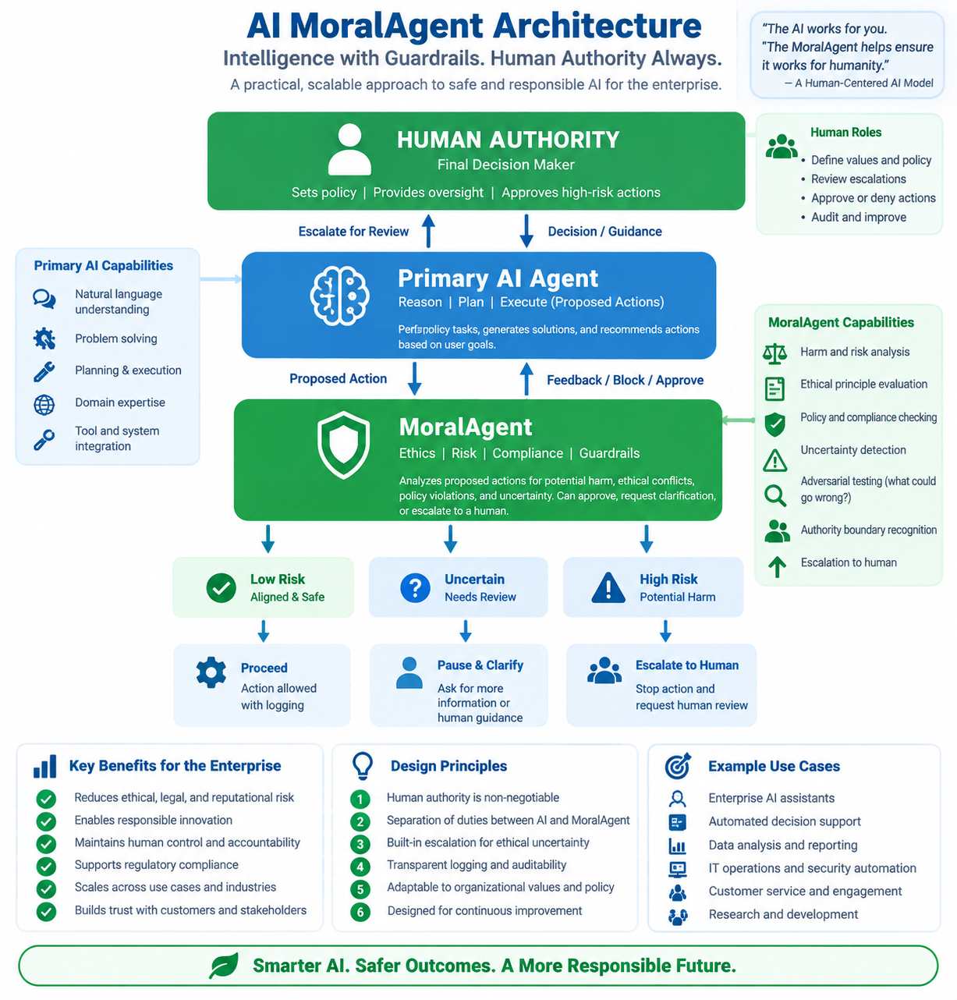

# MoralAgent

## Human-Centered Ethical Governance for AI



AI systems are becoming increasingly capable of reasoning, planning, and taking actions on behalf of people and organizations.

But intelligence does not necessarily create morality.

An AI can understand the concepts of good, evil, harm, ethics, and responsibility without experiencing those concepts in the same way a human does.

This creates an important question:

> **How should an AI system respond when a proposed action may create significant ethical, moral, legal, or societal harm?**

MoralAgent is a proposed architectural layer designed to help address that problem.

---

## The Concept

MoralAgent operates alongside a primary AI system as an independent **ethical risk and escalation layer**.

Its purpose is not to replace human judgment or become the moral authority.

Its purpose is to:

**Detect → Question → Pause → Escalate → Human Decision**

When an AI proposes an action that may create significant harm or ethical uncertainty, MoralAgent can challenge the action, pause further execution, and escalate the issue to an authorized human decision-maker.

---

## Core Principle

> **AI may identify an ethical concern.  
> AI should not become the final authority over human values.**

Human beings remain responsible for defining organizational values, policies, ethical boundaries, and consequential decisions.

---

## Proposed Architecture

```text
                    HUMAN AUTHORITY
                 Final Decision Maker
                          │
                          ▼
                 ┌─────────────────┐
                 │  PRIMARY AI     │
                 │                 │
                 │ Reason          │
                 │ Plan            │
                 │ Execute         │
                 └────────┬────────┘
                          │
                    Proposed Action
                          │
                          ▼
                 ┌─────────────────┐
                 │   MORALAGENT    │
                 │                 │
                 │ Ethics          │
                 │ Risk            │
                 │ Compliance      │
                 │ Harm Analysis   │
                 │ Uncertainty     │
                 │ Adversarial     │
                 │ Review          │
                 └────────┬────────┘
                          │
              ┌───────────┼───────────┐
              ▼           ▼           ▼
           LOW RISK    UNCERTAIN    HIGH RISK
              │           │           │
              ▼           ▼           ▼
           PROCEED      PAUSE       STOP
                          │           │
                          └─────┬─────┘
                                ▼
                         HUMAN REVIEW
